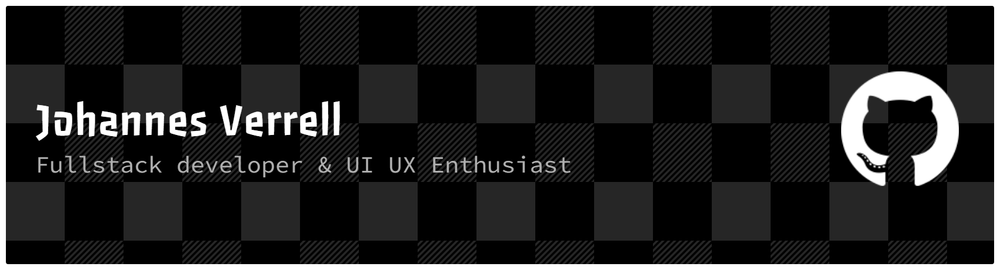

## Undergraduate Computer Science Major on Binus University Alam Sutera

## 🌐 Socials:
   

# 💻 Tech Stack:

  
  
  
  
  
  
  
  
  
  
  
  
  
  
  
  
  
  
  
  
  
  
  
  
  
  
  
  
  
  
  
  
  
  
  
  
  
  
  
  
  
  
  

# 📊 GitHub Stats:
 
 

### ✍️ Random Dev Quote

### 🔝 Top Contributed Repo

---

###

<picture>
  <source media="(prefers-color-scheme: dark)" srcset="https://raw.githubusercontent.com/jhnsvrll1/jhnsvrll1/output/pacman-contribution-graph-dark.svg">
  <source media="(prefers-color-scheme: light)" srcset="https://raw.githubusercontent.com/jhnsvrll1/jhnsvrll1/output/pacman-contribution-graph.svg">
  
</picture>

###

<!-- Proudly created with GPRM ( https://gprm.itsvg.in ) -->
<!--
**jhnsvrll1/jhnsvrll1** is a ✨ _special_ ✨ repository because its `README.md` (this file) appears on your GitHub profile.

Here are some ideas to get you started:

- 🔭 I’m currently working on ...
- 🌱 I’m currently learning ...
- 👯 I’m looking to collaborate on ...
- 🤔 I’m looking for help with ...
- 💬 Ask me about ...
- 📫 How to reach me: ...
- 😄 Pronouns: ...
- ⚡ Fun fact: ...
-->
